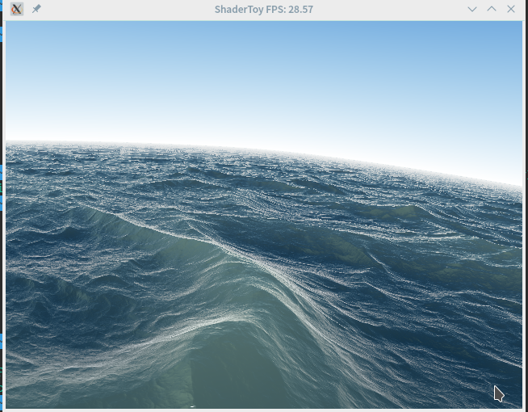
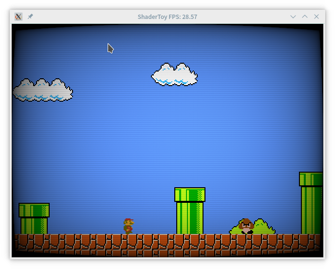
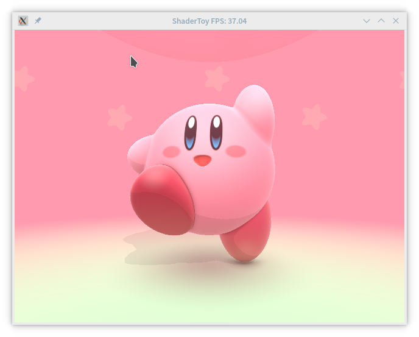

# ShaderToy 桌面版

## 1.ShaderToy 是什么  
Shader（着色器）语言是一种编程语言，它被编译后会在显卡的GPU上运行，Shader在屏幕特效上有着强大的作用，基于Shader，可以做出炫酷的屏幕效果，被广泛用在游戏上。现代有三种主流的着色器语言， OpenGL/ES 的GLSL，Direct3D 的HLSL, 以及Nvidia的Cg。现代浏览器已经支持OpenGL ES的javascript绑定WebGL, 所以浏览器上也可以使用GLSL进行编程。ShaderToy是一个使用GLSL编写着色器代码并观察效果的网站，网站上有丰富的展示作品，惊叹人类的创意和艺术的美感。  

Shader (shader) language is a programming language that will be compiled to run on the GPU of the graphics card. Shader has a powerful effect on the screen effect. Based on Shader, it can make a cool screen effect and is widely used in the game. In modern times, there are three mainstream shader languages, OpenGL/ES's GLSL, Direct3D's HLSL, and Nvidia's Cg. Modern browsers have supported OpenGL ES's JavaScript binding WebGL, so GLSL can also be used for programming on browsers. ShaderToy is a website that uses GLSL to write the code of the shader and observe the effect. The website has a rich display of works and marvel at the beauty of human creativity and art.

## 2.为什么要做ShaderToy 桌面版
由于显卡的性能和网络带宽的限制，打开**ShaderToy**会导致浏览器卡顿。便萌生了开发出一个桌面版的ShaderToy, 方便在离线环境下自由的编写着色器代码。项目使用C/C++作为编程语言,第三方库使用了跨平台的多媒体库SDL2, 获取OpenGL扩展的函数库GLEW以及图像加载库stb_image。SDL2可以用于创建桌面窗口，捕获键盘以及鼠标事件并管理OpenGL的上下文；GLEW库可以获取到OpenGL的运行时函数指针和获取到OpenGL的扩展函数；stb_image库的作用在于加载图像文件到内存中，解析图像文件的参数，方便创建OpenGL的纹理。

Due to the performance of card and the limitation of network bandwidth, opening ShaderToy will cause browser Catton. A desktop version of ShaderToy was developed,Easy to write shader code in offline environment. and C/C++ was used as a programming language. The third party library used a cross platform multimedia library SDL2 to obtain the OpenGL extension function library GLEW and the image loading library stb_image. The SDL2 can be used to create a desktop window, capture the keyboard and mouse events and manage the context of the OpenGL; the GLEW library can get the runtime function pointer to the OpenGL and the extension function to the OpenGL; the function of the stb_image library is to load the image files into memory, parse the parameters of the file like the file, and facilitate the creation of the lines of the OpenGL. Reason.

## Demo展示  

以下Demo来自ShaderToy网站的资源

``` GLSL
void mainImage( out vec4 fragColor, in vec2 fragCoord )
{
    // Normalized pixel coordinates (from 0 to 1)
    vec2 uv = fragCoord/iResolution.xy;

    // Time varying pixel color
    vec3 col = 0.5 + 0.5*cos(iTime+uv.xyx+vec3(0,2,4));

    // Output to screen
    fragColor = vec4(col,1.0);
}
```
1. SeaScape


2. Mario's Worldd


3. Kirby



